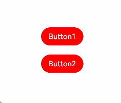

## 从harmonyOS文档开始学习

[harmonyOS官方文档](https://developer.huawei.com/consumer/cn/doc/harmonyos-guides-V5/start-with-ets-stage-V5)

</br>

TypeScripts也不熟悉,从官网也学习一下

[TypeScripts官方文档](https://typescript.bootcss.com/)


>前面主要介绍ArkTS和原始TS的一些区别,并且针对两者之间的语法转化给了很多的示例,可以在"从TypeScripts到ArkTS的适配规则"这一章节中找到,包括ArkTS语法能够更高效的原因之一,就是方舟字节码,也可以通俗理解为汇编?不知道这么理解对不对,没有仔细看了,只是觉得很像
着重还是学习UI格式,这是后面用到的最直接的内容


<center>ArkTS的基本组成</center>

## 学习笔记

### UI基本语法
build()函数：build()函数用于定义自定义组件的声明式UI描述，自定义组件必须定义build()函数。

生命周期流程如下图所示，下图展示的是被@Entry装饰的组件（页面）生命周期。


自定义布局,这是一个不错的例子


ArkUI还提供了一种更轻量的UI元素复用机制@Builder，@Builder所装饰的函数遵循build()函数语法规则，开发者可以将重复使用的UI元素抽象成一个方法，在build方法里调用。
为了简化语言，我们将@Builder装饰的函数也称为“自定义构建函数”。


@Styles装饰器：定义组件重用样式


@Extend装饰器：定义扩展组件样式

[使用场景](https://developer.huawei.com/consumer/cn/doc/harmonyos-guides-V5/arkts-extend-V5#使用场景)

以下示例声明了3个Text组件，每个Text组件均设置了fontStyle、fontWeight和backgroundColor样式。
```h
@Entry
@Component
struct FancyUse {
  @State label: string = 'Hello World'

  build() {
    Row({ space: 10 }) {
      Text(`${this.label}`)
        .fontStyle(FontStyle.Italic)
        .fontWeight(100)
        .backgroundColor(Color.Blue)
      Text(`${this.label}`)
        .fontStyle(FontStyle.Italic)
        .fontWeight(200)
        .backgroundColor(Color.Pink)
      Text(`${this.label}`)
        .fontStyle(FontStyle.Italic)
        .fontWeight(300)
        .backgroundColor(Color.Orange)
    }.margin('20%')
  }
}
```
@Extend将样式组合复用，示例如下。
```h
@Extend(Text) function fancyText(weightValue: number, color: Color) {
  .fontStyle(FontStyle.Italic)
  .fontWeight(weightValue)
  .backgroundColor(color)
}
```

stateStyles：多态样式



### 状态管理
在声明式UI编程框架中，UI是程序状态的运行结果，用户构建了一个UI模型，其中应用的运行时的状态是参数。当参数改变时，UI作为返回结果，也将进行对应的改变。这些运行时的状态变化所带来的UI的重新渲染，在ArkUI中统称为状态管理机制。
自定义组件拥有变量，变量必须被装饰器装饰才可以成为状态变量，状态变量的改变会引起UI的渲染刷新。如果不使用状态变量，UI只能在初始化时渲染，后续将不会再刷新。 下图展示了State和View（UI）之间的关系。

* View(UI)：UI渲染，指将build方法内的UI描述和@Builder装饰的方法内的UI描述映射到界面。

* State：状态，指驱动UI更新的数据。用户通过触发组件的事件方法，改变状态数据。状态数据的改变，引起UI的重新渲染。


* @State：@State装饰的变量拥有其所属组件的状态，可以作为其子组件单向和双向同步的数据源。当其数值改变时，会引起相关组件的渲染刷新。
* @Prop：@Prop装饰的变量可以和父组件建立单向同步关系，@Prop装饰的变量是可变的，但修改不会同步回父组件。

* @Link：@Link装饰的变量可以和父组件建立双向同步关系，子组件中@Link装饰变量的修改会同步给父组件中建立双向数据绑定的数据源，父组件的更新也会同步给@Link装饰的变量。

* @Provide/@Consume：@Provide/@Consume装饰的变量用于跨组件层级（多层组件）同步状态变量，可以不需要通过参数命名机制传递，通过alias（别名）或者属性名绑定。

* @Observed：@Observed装饰class，需要观察多层嵌套场景的class需要被@Observed装饰。单独使用@Observed没有任何作用，需要和@ObjectLink、@Prop联用。

* @ObjectLink：@ObjectLink装饰的变量接收@Observed装饰的class的实例，应用于观察多层嵌套场景，和父组件的数据源构建双向同步。


#### @state

##### 使用箭头函数改变状态变量未生效

箭头函数体内的this对象，就是定义该函数时所在的作用域指向的对象，而不是使用时所在的作用域指向的对象。所以在该场景下， changeCoverUrl的this指向PlayDetailViewModel，而不是被装饰器@State代理的状态变量
```h
import PlayDetailViewModel from './PlayDetailViewModel'

@Entry
@Component
struct PlayDetailPage {
  @State vm: PlayDetailViewModel = new PlayDetailViewModel();

  build() {
    Stack() {
      Text(this.vm.coverUrl).width(100).height(100).backgroundColor(this.vm.coverUrl)
      Row() {
        Button('点击改变颜色')
          .onClick(() => {
            this.vm.changeCoverUrl();
          })
      }
    }
    .width('100%')
    .height('100%')
    .alignContent(Alignment.Top)
  }
}
```

```h
import PlayDetailViewModel from './PlayDetailViewModel'

@Entry
@Component
struct PlayDetailPage {
  @State vm: PlayDetailViewModel = new PlayDetailViewModel();

  build() {
    Stack() {
      Text(this.vm.coverUrl).width(100).height(100).backgroundColor(this.vm.coverUrl)
      Row() {
        Button('点击改变颜色')
          .onClick(() => {
            //类似于先实例化,才能修改值
            let self = this.vm;
            this.vm.changeCoverUrl(self);
          })
      }
    }
    .width('100%')
    .height('100%')
    .alignContent(Alignment.Top)
  }
}
```

#### @prop

* 单向同步：对父组件状态变量值的修改，将同步给子组件@Prop装饰的变量，子组件@Prop变量的修改不会同步到父组件的状态变量上。

#### link
* 双向同步。父组件中@State, @StorageLink和@Link 和子组件@Link可以建立双向数据同步，反之亦然。

示例代码
```h
@Component
struct Child {
  @Link items: number[];

  build() {
    Column() {
      Button(`Button1: push`)
        .margin(12)
        .width(312)
        .height(40)
        .fontColor('#FFFFFF，90%')
        .onClick(() => {
          this.items.push(this.items.length + 1);
        })
      Button(`Button2: replace whole item`)
        .margin(12)
        .width(312)
        .height(40)
        .fontColor('#FFFFFF，90%')
        .onClick(() => {
          this.items = [100, 200, 300];
        })
    }
  }
}

@Entry
@Component
struct Parent {
  @State arr: number[] = [1, 2, 3];

  build() {
    Column() {
      Child({ items: $arr })
        .margin(12)
      ForEach(this.arr,
        (item: number) => {
          Button(`${item}`)
            .margin(12)
            .width(312)
            .height(40)
            .backgroundColor('#11a2a2a2')
            .fontColor('#e6000000')
        },
        (item: ForEachInterface) => item.toString()
      )
    }
  }
}
```


#### provide and consume
@Provide和@Consume通过相同的变量名或者相同的变量别名绑定时，@Provide装饰的变量和@Consume装饰的变量是一对多的关系。


#### observe and objectlink

上文所述的装饰器仅能观察到第一层的变化，但是在实际应用开发中，应用会根据开发需要，封装自己的数据模型。对于多层嵌套的情况，比如二维数组，或者数组项class，或者class的属性是class，他们的第二层的属性变化是无法观察到的。这就引出了@Observed/@ObjectLink装饰器。

#### localstorage and appstorage

和AppStorage不同的是，LocalStorage是页面级的，通常应用于页面内的数据共享。而AppStorage是应用级的全局状态共享，还相当于整个应用的“中枢”，持久化数据PersistentStorage和环境变量Environment都是通过AppStorage中转，才可以和UI交互。

#### PersistentStorage：持久化存储UI状态
示例
```h
PersistentStorage.persistProp('aProp', 47);

@Entry
@Component
struct Index {
  @State message: string = 'Hello World'
  @StorageLink('aProp') aProp: number = 48

  build() {
    Row() {
      Column() {
        Text(this.message)
        // 应用退出时会保存当前结果。重新启动后，会显示上一次的保存结果
        Text(`${this.aProp}`)
          .onClick(() => {
            this.aProp += 1;
          })
      }
    }
  }
}
```

#### @Watch装饰器：状态变量更改通知

@Watch用于监听状态变量的变化，当状态变量变化时，@Watch的回调方法将被调用。@Watch在ArkUI框架内部判断数值有无更新使用的是严格相等（===），遵循严格相等规范。当在严格相等为false的情况下，就会触发@Watch的回调。

@watch何时被调用
* 当观察到状态变量的变化（包括双向绑定的AppStorage和LocalStorage中对应的key发生的变化）的时候，对应的@Watch的回调方法将被触发；
* @Watch方法在自定义组件的属性变更之后同步执行；
* 如果在@Watch的方法里改变了其他的状态变量，也会引起状态变更和@Watch的执行；
* 在第一次初始化的时候，@Watch装饰的方法不会被调用，即认为初始化不是状态变量的改变。只有在后续状态改变时，才会调用@Watch回调方法。


#### $$语法：内置组件双向同步
```h
// xxx.ets
@Entry
@Component
struct TextInputExample {
  @State text: string = ''
  controller: TextInputController = new TextInputController()

  build() {
    Column({ space: 20 }) {
      Text(this.text)
      TextInput({ text: $$this.text, placeholder: 'input your word...', controller: this.controller })
        .placeholderColor(Color.Grey)
        .placeholderFont({ size: 14, weight: 400 })
        .caretColor(Color.Blue)
        .width(300)
    }.width('100%').height('100%').justifyContent(FlexAlign.Center)
  }
}
```


#### MVVM模式


#### 状态管理合理使用开发指导

* ForEach使用


### 渲染控制

#### Repeat：循环渲染(推荐)

# 应用开发框架
